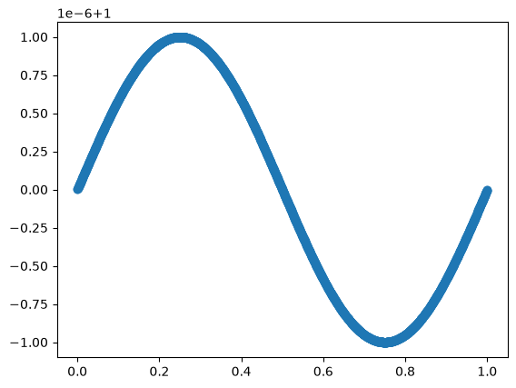

# Stellar Feedback Experiments with GIZMO

## What is GIZMO?

`GIZMO` is a multi-physics, multi-method radiation MHD code for astrophysics that is designed mainly around a set of mesh-free weighted-partition finite-volume methods. These methods essentially generalize the way a Voronoi tesselation moving-mesh code solves conservation laws through exchange of fluxes across the moving faces between domains (as in e.g. [Arepo](https://arepo-code.org/wp-content/userguide/index.html)). Think of it like a moving mesh, but where each point in space is assigned only a certain *weight* associated with each neighboring mesh-generating point. The discretization looks like a Voronoi tesselation with blurred boundaries.

[**It's not SPH**](https://starforge-tools.readthedocs.io/en/latest/data.html#what-is-a-gas-cell-in-a-gizmo-mfm-mfv-simulation). A kernel spline function is involved, and there are many structural similarities between the algorithms used by GIZMO and SPH codes, but the method for solving conservation laws is fundamentally distinct. It is best to think of the discrete simulation elements as finite-volume "cells", not particles. However, the terms are often used interchangeably.

For us, the important thing is that `GIZMO` implements a wide variety of stellar feedback processes including protostellar jets, stellar winds, radiation, and supernovae, as well as the key ISM chemical and thermal processes that determine the impact that stellar feedback has. We will use `GIZMO` as a laboratory to experiment with stellar feedback.

## Setting up your GIZMO stack

### Prerequisites

You will need a python environment in a reasonably-modern version (e.g. 3.10+) to use most of the supported tools and GIZMO's automatic testing system. 

### Required packages
At minimum, building GIZMO requires two widely-available packages:
- HDF5
- GSL (GNU Scientific Library)

To use the FFT-based gravity solver you also need `FFTW3`, but it is not required for many problems.

The paths to these libraries must be known by the build system. This is set up for a variety of pre-set system configurations in `Makefile` (including common setups like a Macbook with Homebrew packages (`MacBookCellar`), and PSMN).


## Getting the code

``git clone https://github.com/mikegrudic/gizmo_leshouches``

This is a branch of GIZMO managed for the purposes of this workshop.

``git clone https://github.com/mikegrudic/MakeCloud``

## Building GIZMO

GIZMO's build system works as follows:

0. Specify the system environment setup you wish to build with. Different setups for different implemented HPC environments are found in different cases in the `Makefile`. For example, there is a `PSMN` environment. If you are running on a Mac with packages installed via homebrew, you can use `MacbookCellar`. To tell it which to use,
1. Specify the options to compile the binary with in a file `Config.sh`. At baseline, essentially everything we would want to run for our stellar feedback experiments would include the following:
```
SINGLE_STAR_STARFORGE_DEFAULTS
BOX_PERIODIC
SELFGRAVITY_OFF
COOLING
OUTPUT_COOLRATE_DETAIL
```

For full description of the different flags you can enable, see the [gizmo documentation](http://www.tapir.caltech.edu/~phopkins/Site/GIZMO_files/gizmo_documentation.html) or have a scroll through `Template_Config.sh`.

Note that `SINGLE_STAR_STARFORGE_DEFAULTS` enables a whole host of modules for the problems we will be running (see `declarations/precompiler_logic.h` for details.)

2. run `make -j` to run the build in parallel (leave out the `-j` if using all the cores doesn't happen to be good citizenship on the system you are on).


### Config flags for different feedback mechanisms

* Radiation: to enable the full, 5-band radiative transfer treatment, enable `SINGLE_STAR_FB_RAD`. This will account for photons in the EUV (i.e. H-ionizing), FUV, NUV, Optical/Near-IR, and far-IR bands. To get more granular control over which radiation bands you include, see e.g. `test/HII_region/Config.sh`. Another important parameter is the speed-of-light-reduction factor, which allows us to take larger timesteps by slowing down light. A good setting to start with is `RT_SPEEDOFLIGHT_
* Winds: `SINGLE_STAR_FB_WINDS=2` is the default setting. The value is a bitflag: the least-significant bit toggles whether the Vink 2001 mass-loss prescription is used, otherwise the weaker STARFORGE prescription is used. The next-to-least significant bit toggles whether to use the more-powerful Sabhahit 2022 prescription for very massive stars. The default `2` setting combines the STARFORGE prescription and the Sahahit prescription (taking the larger of two $\dot{M}$'s).
* Supernovae: `SINGLE_STAR_FB_SNE` makes stars explode in a $10^51 \rm erg$ supernova at the end of their lifetime. Note that you will need to initialize the star's age appropriately if you want a SN to go off at the beginning of your simulation.


## Running test problems

GIZMO has an automatic testing system. A host of test problems can be found in `tests/`, which can be run with pytest. For example, the most basic test for a linear soundwave can be run with 

`pytest test/soundwave`

and the simulation output snapshots will be placed in `test/soundwave/output`. At minimum, pytest will tell you whether or not the test passed. Many tests also generate informative diagnostic plots. It's always a good idea to run a few of these just to make sure GIZMO is working OK on your system.

### Plotting the output
See also: [Interfacing with GIZMO HDF5 outputs](https://starforge-tools.readthedocs.io/en/latest/wiki_pages/interfacing_with_gizmo_starforge_hdf5_outputs.html)

If we wanted to make our own plots, the simplest way is by directly interfacing with the snapshot data with `h5py`:
```python
%matplotlib inline
from matplotlib import pyplot as plt
import h5py

with h5py.File("output/snapshot_015.hdf5") as F:
    x = F["PartType0/Coordinates"][:]
    rho = F["PartType0/Density"][:]

plt.scatter(x[:,0],rho)
```


    <matplotlib.collections.PathCollection at 0x7f77d00ec980>


    


Note the hierarchical structure of the snapshots: "particle" type at the top level, with each particle type having a set of attributes. For full documentation of the data fields see the GIZMO docs, but some specific fields we may encounter in star formation setups are described in detail in the [starforge documentation]()


## Setting up an ISM cloud 

[`MakeCloud`](github.com/mikegrudic/MakeCloud/) is a tool for setting up the initial conditions for idealized GMC or ISM cloud simulations. It has many different options with certain convenient defaults.  Run `MakeCloud -h` to get a rundown of all of the different options. By default, MakeCloud assumes God's system of units for dealing with objects on the scale of GMCs and star clusters: $M_\odot$, $\rm km\,s^{-1}$, $\rm pc$, and $\rm G$. The resulting time unit is $T = \rm pc / (km\,s^{-1}) \approx 1 \rm Myr$. Nice, right?

An important thing to note when setting up GIZMO simulations is that, typically, we are following finite-mass, quasi-Lagrangian elements around, so we must specify a *mass* resolution, and the spatial resolution adapts to the density as $\Delta x = \left(\Delta m/\rho\right)^{1/3}$. When running `MakeCloud`, we can specify the mass resolution via either the `--N` parameter (which specifies the number of gas cells initially in the cloud), or the `--dm` parameter (which sets the actual $\Delta m$ in code units).

`MakeCloud` will generate the HDF5 initial conditions file for the cloud, as well as a parameter file with some sensible defaults. Note that if you want a static cloud you must pass `--alpha_turb=0`, otherwise the cloud will be initialized with random turbulent velocities.

## Running the simulation

The basic command to run `GIZMO` on one core is `./GIZMO params.txt 0`. The parameters file specifies where the initial conditions file can be found. The latter `0` flag indicates that we want to start a brand-new simulation, as opposed to restarting from a set of restartfiles (`1`) or from a snapshot (`2`).

GIZMO is hybrid MPI/OpenMP code, but it can be run in pure MPI mode, and we will do so for simplicity unless (god forbid) we end up tuning a performance bottleneck for the project. If using OpenMP threads, the environment variable `OMP_NUM_THREADS` must be set.

A script for submitting a GIZMO job on PSMN is:
```bash
#!/bin/bash
#SBATCH --job-name=gizmo
#SBATCH --partition=Lake-short          # 4h limit; use Lake-long for longer runs
#SBATCH --nodes=1
#SBATCH --ntasks=24                     # MPI ranks (total across all nodes)
#SBATCH --cpus-per-task=1              # OMP threads per rank; set >1 for hybrid MPI+OMP
#SBATCH --time=04:00:00
#SBATCH --output=%x_%j.out

GIZMO=~/gizmo/GIZMO
PARAMS=params.txt

export OMP_NUM_THREADS=$SLURM_CPUS_PER_TASK

srun --mpi=pmix_v5 --cpu-bind=none "$GIZMO" "$PARAMS" 0
```

The additional flags in the `srun` command were needed to get hybrid mode to work but may not be necessary for pure MPI...

## Visualizing the output

The basic procedure for interfacing with the data is demonstrated above for the soundwave test, but there are many tools to help make various maps of the fluid quantities. Just a few examples are:

* The [meshoid](https://github.com/mikegrudic/CrunchSnaps) package provides the basic low-level projection and slicing operations that you can use to generate maps, to further  in whichever backend you choose.
* Building on top of meshoid, the [CrunchSnaps](https://github.com/mikegrudic/CrunchSnaps) package includes the powerful [SinkVis2 command-line tool](https://crunchsnaps.readthedocs.io/en/latest/sinkvis2.html) and python API for making slice and projection maps of the data. It can be called from the command line or from inside a notebook.
* GIZMO is supported by the very popular simulation analysis package [`yt`](https://yt-project.org/). If you are already familiar with `yt` then.
* [vizmo](https://github.com/mikegrudic/vizmo) provides interactive, real-time 3D fly-through exploration of simulation data, including GIZMO. New, experimental, vibecoded slop, have fun!
* Other visualization tools are mentioned in the [gizmo documentation](http://www.tapir.caltech.edu/~phopkins/Site/GIZMO_files/gizmo_documentation.html).

## Baseline experiments

To start, try to obtain 3 basic solutions for a **stellar wind bubble**, an **HII region** with only radiative feedback, and a **supernova remnant** in a uniform-density medium. For each of these, try at least 3 different numerical resolutions and assess the numerical convergence.

Some good quantities to plot are:
- Kinetic, thermal, and magnetic (if applicable) energies
- $n_{\rm H}$ vs. $T$ phase diagram at different times. What is happening in various regions of the phase diagram?
- Post-shock temperature: is it consistent with analytic expectations for the velocity of the shock?
- The bubble shell radius versus time.
- Total radial momentum versus time.
- Total cooling rate (make sure to include the `OUTPUT_COOLRATE_DETAIL` flag in your Config.sh).
- Mass in different phases.
- Radial temperature structure at different times.
- Surface density maps: does the bubble remain spherical? If not, what structures develop?

Try to understand these results: do they make sense for the physical processes at work? Where applicable, compare these quantities with analytic expectations (we will discuss these in detail in feedback lecture 1).

## Further Explorations
Feedback-driven flows are an active area of research, and most cases that are more complex than the simple uniform-density bubbles above are essentially open problems: many have been explored, but there is generally no comprehensive theory. Here are some ideas for additional questions to explore. If there is another question that interests you, it may also be possible to explore with `GIZMO`, so have fun with it!

In general, try to compare your solutions with the most-applicable analytical bubble solutions. In all instances, try to run with multiple levels of numerical resolution so you know whether or not your result is converged.


### Interplay of different feedback mechanisms
To what extent do radiation, winds, and supernovae work together as more than the sum of their parts? You can run a simulation combining some or all of these feedback channels and compare the solution with your baseline solutions: does one dominant feedback mechanism operate independently of the others, or do they interfere constructively?

### Clustered feedback
Stars form in a clustered configuration, so in general feedback bubbles overlap. What happens when multiple massive stars are present, going supernova at different times? Can we model this analytically somehow?

### Effect of turbulent density and velocity structure
The first-order difference between our uniform-density cloud model and reality is the fact that the ISM is in a state of trans- to super-sonic turbulence, and has rich density structure. In principle this can affect the way feedback bubbles evolve, by changing the porosity to venting warm/hot gas or changing the transport of energy by facilitating mixing.

#### Initializing turbulence
To add turbulent density structure to the simulation, we must do an initialization run. We can *initialize* the turbulent velocities by-hand and run the simulation to allow the density structure to develop, just by setting `--alpha_turb` > 0 in `MakeCloud`. 

Alternately or complementarily, we can *drive* the turbulence continuously by enabling `TURB_DRIVING`, whose parameters are controlled in the parameters file. The default parameters written by `MakeCloud` are sensible for implementing the "TURBSPHERE" setup described in [Lane et al. 2022](https://academic.oup.com/mnras/article/510/4/4767/6482854), which gives you an isolated, localized cloud embedded in a diffuse box. This is more realistic than a simple periodic box setup (also available via `--makebox`) for feedback experiments because the low-density boundary conditions can allow the pressurized gas to vent out of the cloud, changing the dynamics. To get the artificial potential that confines the cloud to the center of the box, enable `STARFORGE_GMC_TURBINIT=1`. Then, run for a few crossing times until a statistical steady state has been achieved. A good plot to check is the gas half-mass radius versus time during the stirring phase.

Once the stirring is complete, you can use the final snapshot of the stirring run as the initial condition of your feedback run - just remember to disable `STARFORGE_GMC_TURBINIT` for the feedback setup.

### Magnetic Fields

Enabling `MAGNETIC` will build GIZMO with MHD enabled. Magnetic pressure and tension can affect the way feedback bubbles evolve in various ways, notably by pressure-confining the expansion (e.g. Krumholz 2006), or stabilizing phase interfaces and suppressing energy transport through mixing (e.g. Lancaster 2024).

### Conduction

Thermal conduction is potentially an important energy transport mechanism for hot feedback bubbles produced by winds and supernovae. This can be accounted for by adding the following flags:

```
CONDUCTION
CONDUCTION_SPITZER
DIFFUSION_OPTIMIZERS
```

Note that these are enabled by default if `SINGLE_STAR_STARFORGE_DEFAULTS` and `MAGNETIC` are enabled. In the MHD case, the full anisotropic heat conduction along magnetic field lines will be solved.

### Eccentric feedback sources
Another complication is that the star or star cluster will not generally be in the exact center of the cloud, breaking out from the edge everywhere simultaneously. Instead, a "blister" can form. How does the evolution compare to the centered case?

### Distributed versus point-source feedback

What if 2 or more stars are distributed throughout the cloud instead of being clustered together? Does this change the bubble evolution or form any new structures?

### Metallicity
Most of the cooling processes governing the evolution of feedback-driven flows are due to metals. How are the evolution of HII regions, wind bubbles, and supernova remnants affected when we vary things from the default Solar metallicity?

### Effects of numerics

`GIZMO` implements a variety of solvers including different SPH flavors and its signature Meshless Finite Mass (MFM) and Meshless Finite Volume (MFV) methods. All solvers are wrong in their own peculiar ways, and the trick is to find the one best-suited to your problem.

How does your solution change when you switch the numerical solver? What is robust to these choices, and what is a numerical artifact?


### Protostellar jets
We haven't mentioned these yet because they require simulations with on-the-fly star formation, but protostellar jets can also be an important process for regulating the formation of individual stars and the state of turbulent gas in protostellar clusters.

Run a low-mass cloud/clump at a mass resolution at least as fine as $10^{-2}M_\odot$ (to resolve at least some of the IMF) with self-gravity, and compare the baseline run with a run that enables `SINGLE_STAR_FB_JETS`. What do the jets do to the properties of the cloud? The rate of star formation? The mass distribution of stars?