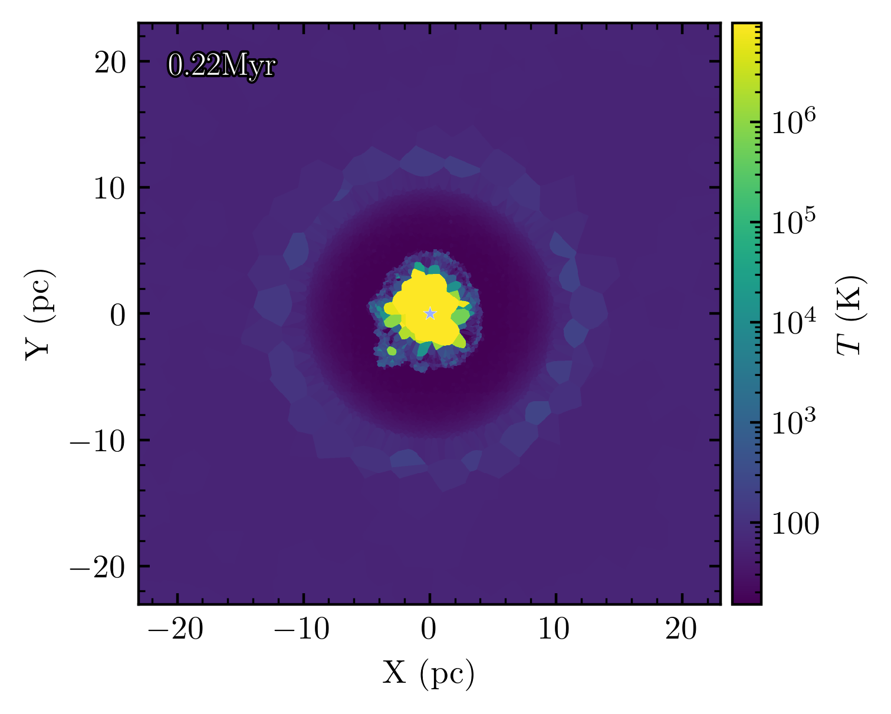

# Visualizing the output

The basic procedure for interfacing with the data is demonstrated above for the soundwave test, but there are many tools to help make various maps of the fluid quantities. Just a few examples are:

* The [meshoid](https://github.com/mikegrudic/meshoid) package provides the basic low-level projection and slicing operations that you can use to generate maps, to further use in whichever plotting backend you choose (e.g. `pcolormap`).
* Building on top of meshoid, the [CrunchSnaps](https://github.com/mikegrudic/CrunchSnaps) package includes the powerful [SinkVis2 command-line tool](https://crunchsnaps.readthedocs.io/en/latest/sinkvis2.html) and python API for making slice and projection maps of the data. It can be called from the command line or from inside a notebook.

*Example of a temperature slice plot made by `SinkVis2`*

* GIZMO is supported by the very popular simulation analysis package [`yt`](https://yt-project.org/). If you are already familiar with `yt` then this is probably the path of least resistance!
* [vizmo](https://github.com/mikegrudic/vizmo) provides interactive, real-time 3D fly-through exploration of simulation data, including GIZMO. New, experimental, vibecoded hell-slop, have fun!
* Other visualization tools are mentioned in the [gizmo documentation](http://www.tapir.caltech.edu/~phopkins/Site/GIZMO_files/gizmo_documentation.html).

