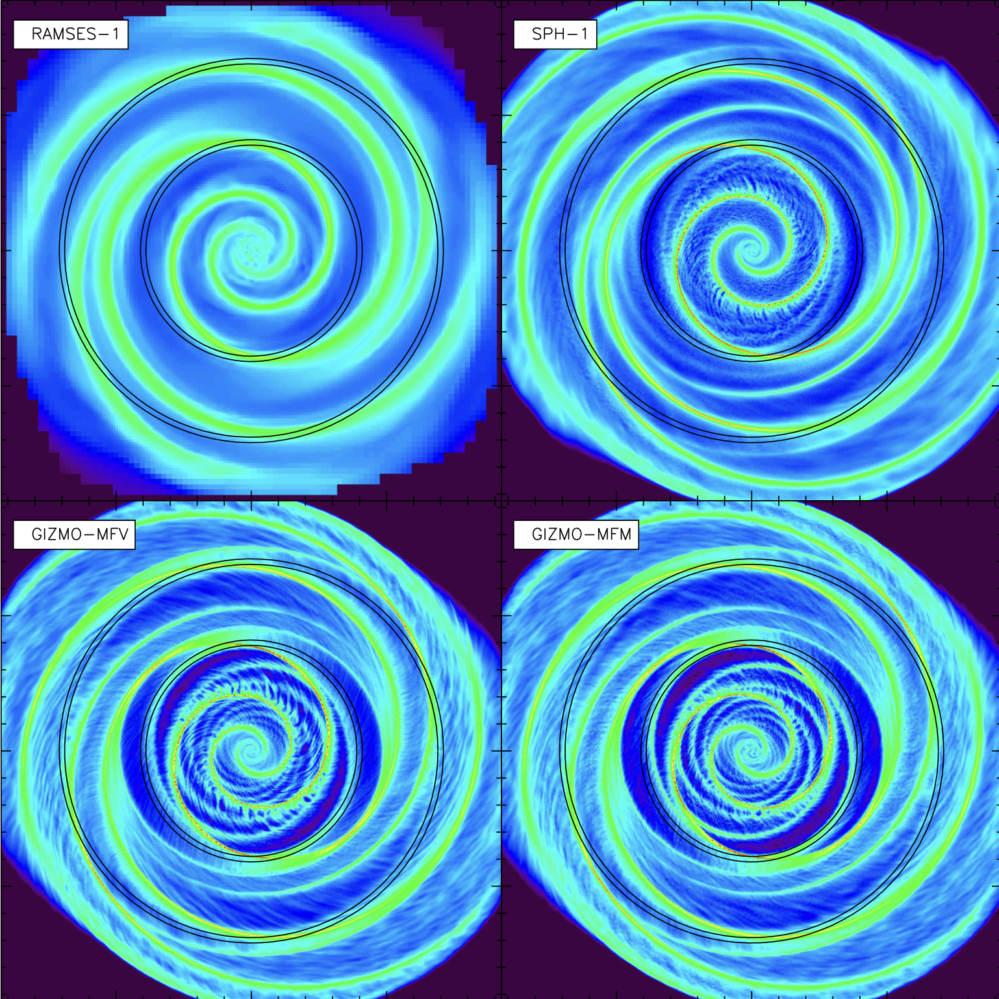

# Why GIZMO?

For us, the important thing is that **the numerical methods that GIZMO implements are often advantageous for star and galaxy formation problems**. One major advantage of is that the resolution elements follow the flow of the fluid. This makes the operation of advection much less **diffusive** than Eulerian simulations (e.g. RAMSES, ATHENA, FLASH). This allows structures formed in supersonic flows to be generally better-preserved, and a lesser degree of resolution is often required to converge on certain properties of the flow: you can often do less with more.

*Comparison of an isothermal galaxy disk simulated with RAMSES AMR, SPH, and GIZMO's MFM and MFV methods at comparable resolution. Note the finer structure that is preserved by the Lagrangian methods in this highly supersonic flow ([Few 2016](https://ui.adsabs.harvard.edu/abs/2016MNRAS.460.4382F/abstract)).*

The trade-off is that mesh-free codes will typically be intrinsically slower than grid codes if the timesteps and numerical resolution are the same: the necessity of neighbor searching and tree traversals tends to make the computation more limited by moving data around than actual FLOPS. For the same reason it's also much harder to put on a GPU!

Another tradeoff is that you do not have the same freedom to arbitrarily specify your spatial resolution.

`GIZMO` also implements a wide variety of stellar feedback processes including protostellar jets, stellar winds, radiation, and supernovae, as well as the key ISM chemical and thermal processes that determine the impact that stellar feedback has. [Here](https://youtu.be/LeX5e51UkzI) is an example of a star formation calculation carried out with GIZMO. We will use `GIZMO` as a laboratory to experiment with stellar feedback.
